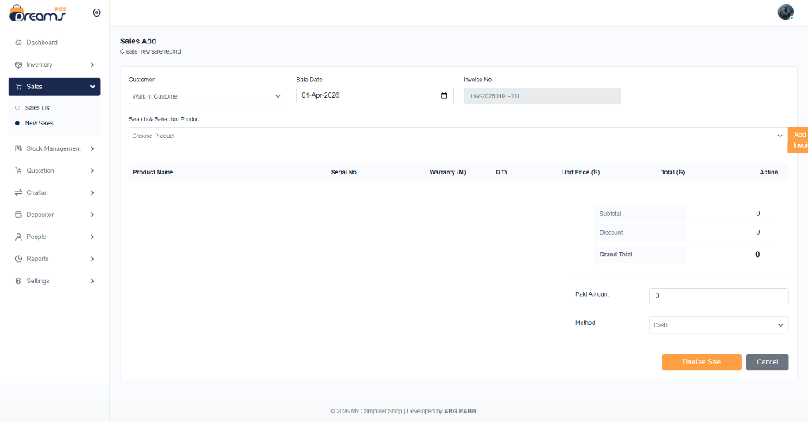
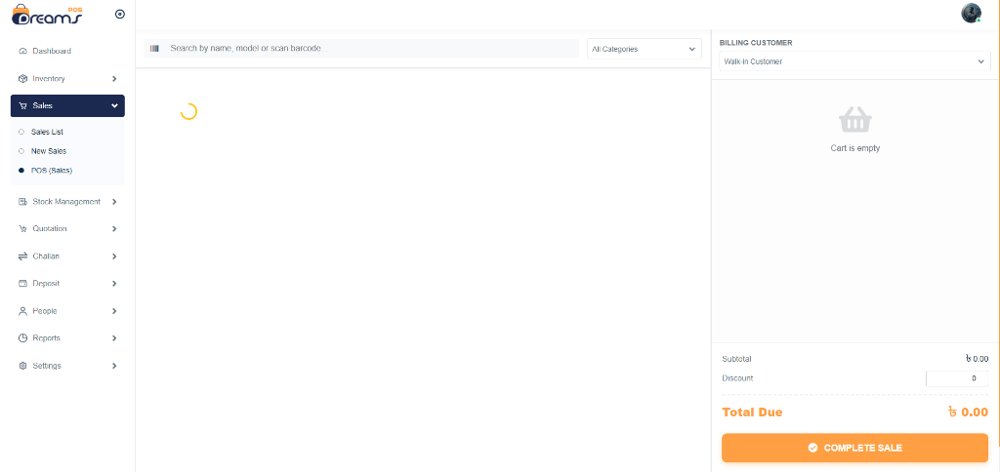

# Inventory Management System (Raw PHP & MySQL)

<p align="center">
  
  
</p>

A professional electronics shop management system built with raw PHP, MySQL, and modern frontend technologies. Optimized for performance and high information density.

## 🚀 Features
- **Dashboard**: Real-time sales, profit, and stock alerts.
- **Product Management**: Category, Brand, and Image upload support.
- **Stock Management**: Sequential invoice generation, Serial number tracking, and Warranty months.
- **Sales Module**: POS-like multi-row sales with Cash/Due automatic tracking.
- **Challan & Quotation**: Complete delivery challan and quotation management with pro-printing.
- **Expenses & Depositors**: Track utility costs and external investments with dedicated reports.
- **Advanced Reporting**: Sales, Purchases, Stock (Inventory), Profit & Loss, and Depositor analytics.
- **Multi-role Access**: Admin, Salesman, Stock Manager, and Accountant roles.
- **Settings**: Dynamic company logo, name, phone, and address configuration.

## 💻 Tech Stack
- **Backend**: Raw PHP 8.x (No Framework)
- **Database**: MySQL (PDO for security)
- **Frontend**: Bootstrap 4, DataTables, Select2, SweetAlert2, Feather Icons
- **Utility**: SHA2-256 password hashing, CSRF protection, AJAX status updates

## 🛠️ Setup Instructions
1.  Clone this repository to your local server (XAMPP/WAMP htdocs).
2.  Import `inventory/database.sql` into your PHPMyAdmin.
3.  Configure database credentials in `inventory/config/database.php`.
4.  Access via browser: `http://localhost/inventory/`

## 🔑 Default Credentials
- **Email**: `argrabby@gmail.com`
- **Password**: `admin123`

## 🔄 Automated Update System Setup
This system can automatically pull the latest changes from this GitHub repository to your local server once enabled.

### **1. Git Configuration** (One-time)
To allow PHP to run `git pull` from the web server, you must run these commands in your project folder:
```bash
# Allow Git to be run from the web-server user
git config --global --add safe.directory path/to/your/project/folder

# (Optional) Store your credentials if it's a private repo
git config --global credential.helper store
```

### **2. Enabling Auto-Update**
1.  Log in as **Admin**.
2.  Go to **Settings > General Settings**.
3.  Scroll down to **Software Maintenance**.
4.  Toggle **Check & Pull Updates from GitHub** to ON.
5.  Set `Remote Name` (usually `origin`) and `Branch` (usually `main`).

### **3. How it Works**
- Every time an Admin or authorized user logs in, the system checks if your local code matches the remote GitHub version.
- If a new update is found, a **Progress Screen** will appear automatically.
- It performs a `git reset --hard` followed by a `git pull`, ensuring your codebase is 100% updated.
- It also runs any new **Database Migrations** automatically.

## 📜 Credits

Developed with ❤️ by **ARG RABBI**.

---
*Note: This project is optimized for electronic shops requiring serial number and warranty tracking.*
